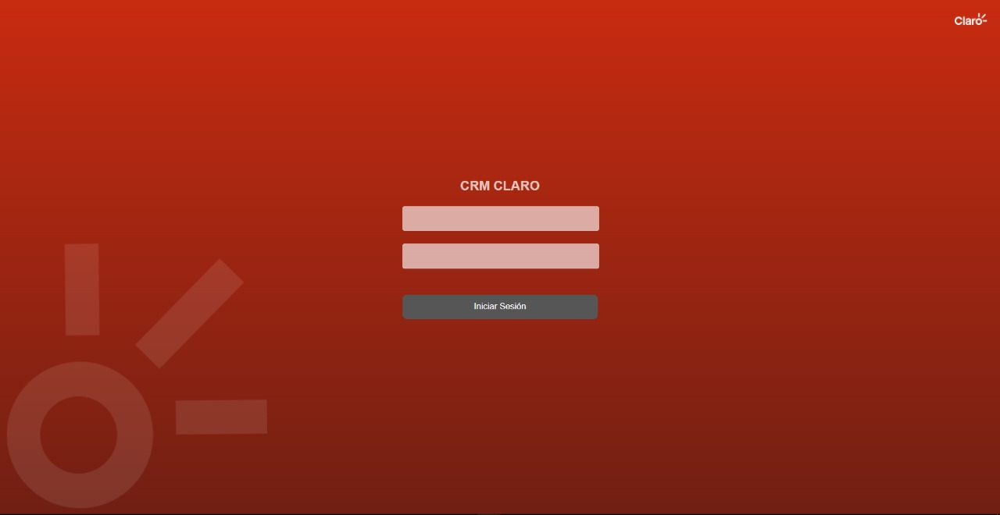
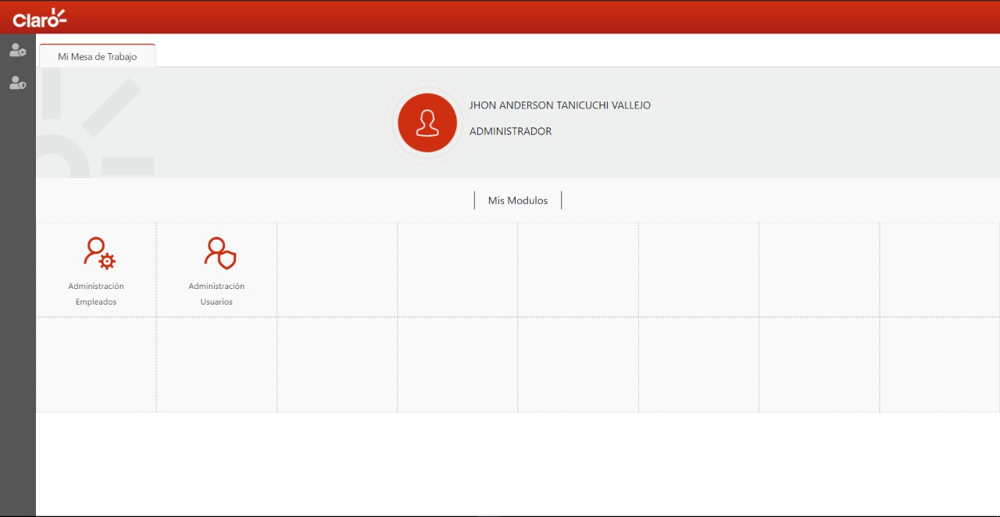
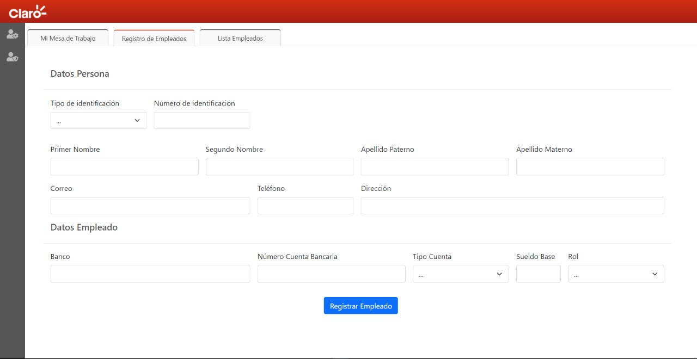
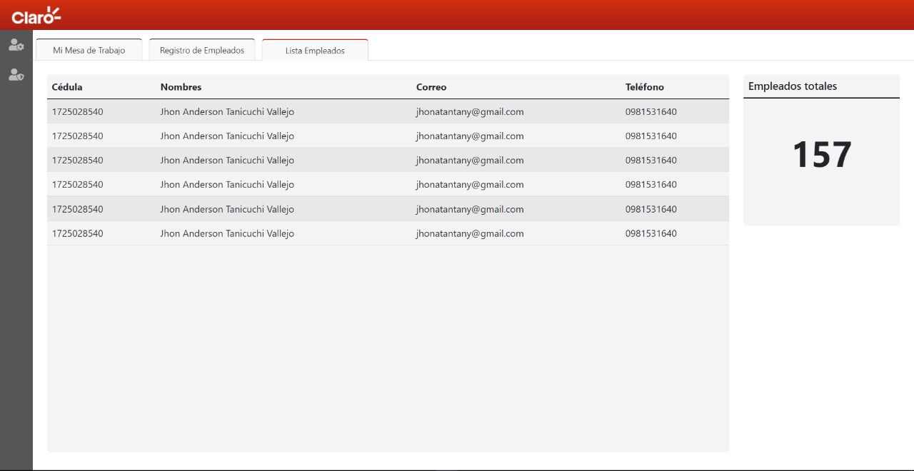
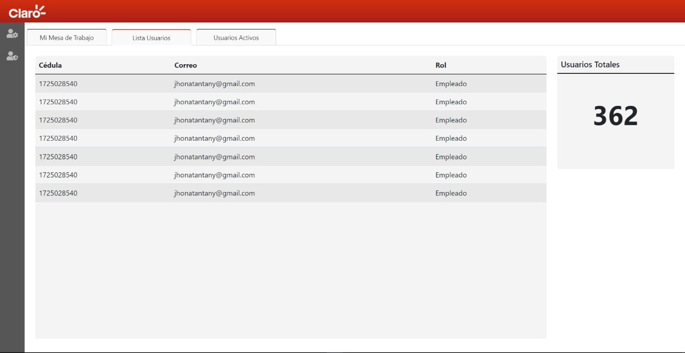
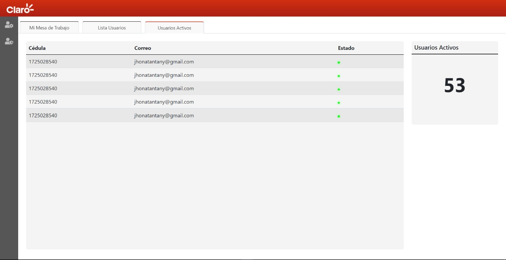

# Crm One

  

CRM One es una plataforma de gestión de clientes desarrollada para la operadora Claro. Proporciona un registro de empleados, control de permisos y seguimiento de actividades relacionadas con los clientes.

## Capturas de Pantalla

  <table style="width: 100%;">
    <tr>
      <td align="center" width="33%">
        
         
        Captura 1
      </td>
      <td align="center" width="33%">
        
         
        Captura 2
      </td>
      <td align="center" width="33%">
        
         
        Captura 3
      </td>
    </tr>
    <tr>
      <td align="center" width="33%">
        
         
        Captura 4
      </td>
      <td align="center" width="33%">
        
         
        Captura 5
      </td>
      <td align="center" width="33%">
        
         
        Captura 6
      </td>
    </tr>
  </table>

## Tecnologías Utilizadas

- PHP
- HTML
- CSS
- JavaScript

## Instalación

1. Clona este repositorio en tu máquina local.
2. Navega hasta la carpeta raíz del proyecto.
3. Configura tu servidor web para que apunte al directorio raíz del proyecto.

## Estructura del Proyecto

La estructura del proyecto se muestra a continuación:

- **controller**: Carpeta que contiene los controladores de PHP utilizados para gestionar la lógica del sistema.

- **model**: Carpeta que contiene los modelos de PHP utilizados para interactuar con la base de datos y obtener los datos necesarios.

- **view**: Carpeta que contiene las vistas de PHP y los archivos de plantillas utilizados para mostrar la interfaz de usuario.

- **index.php**: Archivo principal que sirve como punto de entrada del sistema.

## Uso

1. Inicia tu servidor web y asegúrate de que esté configurado para apuntar al directorio raíz del proyecto.
2. Abre tu navegador web y visita la URL correspondiente a tu servidor local.
3. Explora las diferentes secciones del sistema para acceder al registro de empleados, control de permisos y seguimiento de actividades.
4. Utiliza las funcionalidades del sistema para gestionar los datos de los clientes y realizar un seguimiento adecuado.

## Contribución

¡Gracias por considerar contribuir a este proyecto! Si deseas enviar una solicitud de extracción, asegúrate de seguir estas pautas:

1. Crea una rama específica para tu contribución.
2. Asegúrate de que todas las pruebas pasen antes de enviar la solicitud de extracción.
3. Describe claramente los cambios realizados y explica su propósito.
4. Mantén las líneas de código dentro de los límites de estilo establecidos en el proyecto.

## Contacto

Si tienes alguna pregunta o comentario sobre el proyecto, no dudes en ponerte en contacto con nosotros a través de [jav.tanicuchi@yavirac.edu.ec](jav.tanicuchi@yavirac.edu.ec).
